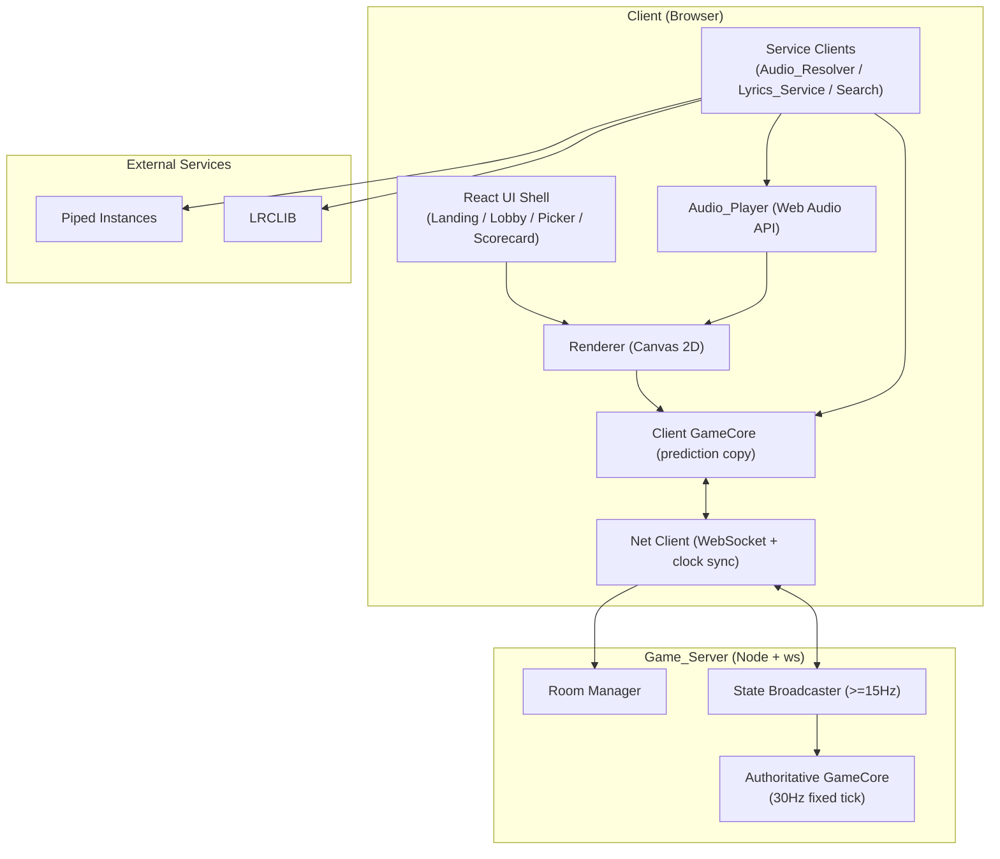
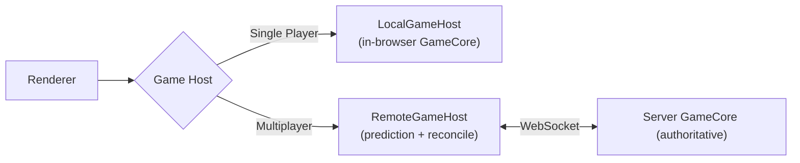
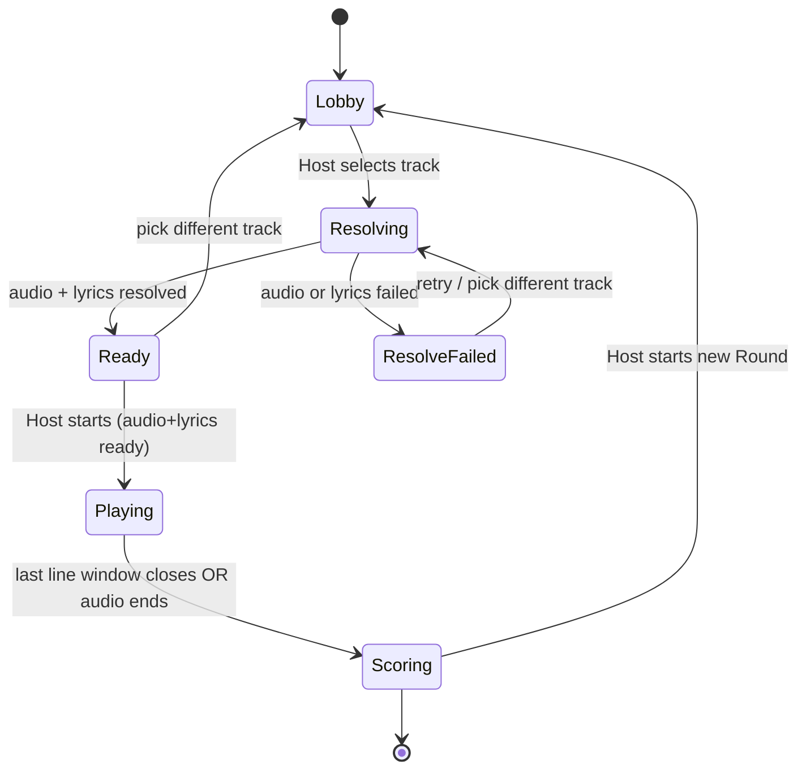

# Design Document

## Overview

Glitch is a real-time multiplayer browser party game ("live imperfect karaoke"). Time-synced lyrics fall from the top of the screen as physics-driven rope-letters built from Verlet particles and distance constraints. Players in a shared Room grab words/letters with their cursors and drag them into the correct order before the next Lyric_Line drops. Each Round ends with a shareable, exportable Scorecard image.

This design is organized around three load-bearing decisions that satisfy the requirements and the two-week, solo-developer constraint:

1. **A single shared `GameCore` module is the source of all gameplay logic.** Physics integration, constraint resolution, ownership-lock state, ordering, and scoring live in one pure, deterministic, dependency-free TypeScript module. It runs authoritatively on the Game_Server during multiplayer and runs *in-process inside the browser* during Single_Player_Mode. Because both modes execute identical code, the ordering and scoring rules are equivalent by construction (Requirements 15.3, 15.4, 9.7), and multiplayer becomes a thin networking layer over a working single-player game (Requirement 15).

2. **The Game_Server is authoritative; the Client predicts and reconciles.** The server runs a fixed ~30Hz tick that owns ground-truth Rope_Letter positions and Ownership_Locks (Requirements 7.6, 14.6, 16.1). The Client runs a prediction copy of the same physics for the letters it grabs so local movement feels instant (<50ms, Requirement 14.4), then reconciles toward authoritative state on every snapshot (Requirements 8.7, 16.2, 16.4).

3. **External services are isolated behind resolver subsystems with uniform timeout and fallback policy.** Audio_Resolver (Piped, multi-instance fallback), Lyrics_Service (LRCLIB), and the search backend all share an 8-second timeout discipline and surface actionable, retryable errors (Requirements 4, 6, 17).

The application has two deliberately opposed art directions. Non-gameplay surfaces (Landing_Page, Lobby, Song_Picker) are **Premium_Entry_Surfaces** — clean, dark, Spotify-style polish (Requirement 18). The in-round play area is the **handmade zine/VHS/ransom-note aesthetic** — scan-lines, paper grain, off-grid cut-out letters (Requirement 12). The two never bleed into each other.

### Technology Stack

| Concern | Choice | Rationale |
| --- | --- | --- |
| Build / app shell | Vite + React + TypeScript | Fast iteration; React owns only top-level UI state, never the physics loop (per research: decouple physics from React render cycles). |
| Styling | Tailwind CSS | Rapid premium-surface layout; gameplay area is raw Canvas, not Tailwind. |
| Gameplay rendering | 2D HTML5 Canvas | Direct pixel control for ransom-note letters, scan-lines, paper grain (Requirement 12). |
| Physics | Custom Verlet engine in `GameCore` | Shared between client prediction and server authority; no external physics dependency. |
| Realtime transport | Node.js WebSocket server (`ws`) | Full-duplex, sub-100ms, authoritative 30Hz tick (research: raw WebSockets are the recommended fabric for fast-paced multiplayer action). |
| Audio | Web Audio API (`MediaElementAudioSourceNode` + `AnalyserNode`) | Streams remote Piped URLs without full download; AnalyserNode exposes amplitude/frequency (Requirement 5). |
| Audio source | Piped API `/streams/:videoId` | Privacy-friendly YouTube frontend; multi-instance fallback (Requirement 4). |
| Lyrics | LRCLIB `/api/get` and `/api/search` | Free, no-auth, returns LRC-format `syncedLyrics` (Requirement 6). |
| Scroll reveal | GSAP + ScrollTrigger | React Bits ScrollReveal pattern on non-gameplay surfaces (Requirement 19). |
| Scorecard export | Canvas `toBlob` | Render Scorecard to canvas, export raster image (Requirement 11). |

## Architecture

### System Context



### Single-Player vs Multiplayer Topology

The same `GameCore` instance is driven by one of two "hosts":

- **Single_Player_Mode**: A `LocalGameHost` runs `GameCore` inside the browser on a `requestAnimationFrame`-driven fixed-timestep accumulator. There is no network, no clock offset, and no Ownership_Lock contention (the single Player implicitly owns any letter they grab). The Renderer reads directly from the local `GameCore`. This is built and shippable first (Requirement 15.1, 15.2).
- **Multiplayer**: A `RemoteGameHost` connects over WebSocket. The authoritative `GameCore` runs on the server; the client keeps a prediction copy of `GameCore` for owned letters and reconciles from snapshots. Presence, Cursor sharing, and Ownership_Locks are layered on top without altering ordering/scoring (Requirement 15.4).



### Fixed-Timestep Loop (decoupled physics)

Per the research blueprint, physics must never be tied to the render cadence. Both server and client advance `GameCore` with a fixed-timestep accumulator and reuse pre-allocated vectors (Requirements 7.2, 14.2, 14.3).

```
const STEP = 1000 / 30;        // ~33.3ms authoritative tick
accumulator += frameDeltaMs;
while (accumulator >= STEP) {
    gameCore.tick(STEP);       // Verlet integrate + constraint relaxation + locks + scoring
    accumulator -= STEP;
}
renderer.draw(gameCore.state, interpolationAlpha);  // render runs at display rate (target 60fps)
```

The Renderer interpolates between the two most recent physics states using `accumulator / STEP` so rendering stays smooth at 60fps even though physics ticks at 30Hz (Requirement 14.1).

### Round State Machine



`Playing` may only be entered from `Ready`; a start attempt while `Resolving`/`ResolveFailed` is rejected as "track not ready" (Requirement 10.5). The transition into `Scoring` finalizes the Round result completely before any Client is notified to show the Scorecard (Requirement 10.4).

## Components and Interfaces

### Client Subsystems

#### React UI Shell
Owns routing and the Premium_Entry_Surfaces (Landing_Page, Lobby, Song_Picker, Scorecard view). Renders semantic HTML headings and labeled controls outside the Canvas (Requirements 13.5, 18.1). Hosts the `<canvas>` element during a Round but does not touch per-frame state. Provides the Reduce_Motion_Mode toggle (Requirement 13.3).

#### Renderer (Canvas 2D)
Draws the gameplay play area in the handmade aesthetic. Responsibilities:
- Draw each Rope_Letter as a cut-out ransom-note glyph with per-letter rotation/placement variation (Requirement 12.1).
- Stamp pre-rendered paper-grain and scan-line textures from off-screen buffers created once at init (Requirements 12.2, 12.4).
- Apply bounded off-grid offsets to play/UI elements (Requirement 12.3).
- Render neo-brutalist container borders (Requirement 12.5).
- Suppress non-essential motion (scan-line jitter, decorative shake) when Reduce_Motion_Mode is on, preserving core gameplay motion (Requirement 13.1).
- React to amplitude/frequency from Audio_Player for reactive effects, handling a `null` AudioFrame (when audio is CORS-unreliable) by disabling audio-reactive effects gracefully (Requirement 5.3).

```typescript
interface Renderer {
  init(canvas: HTMLCanvasElement, opts: RenderOptions): void;
  draw(state: RenderState, alpha: number, audio: AudioFrame | null): void;  // alpha = interpolation factor
  setReduceMotion(enabled: boolean): void;
  dispose(): void;
}
```

#### Physics_Engine (inside GameCore)
See the dedicated [Verlet Physics Model](#verlet-physics-model) section. Runs authoritatively on the server and as a prediction copy on the client.

#### Audio_Resolver
Resolves a playable stream URL for a selected track via Piped, with multi-instance fallback (Requirement 4). Detailed in [External Service Interfaces](#external-service-interfaces).

#### Audio_Player
Loads the resolved URL through the Web Audio API and exposes reactive analysis and playback time (Requirement 5).

```typescript
interface AudioPlayer {
  load(streamUrl: string, corsReliable: boolean): Promise<void>; // 5.1 via MediaElement + Web Audio
  play(): void;                                   // 5.2 from start of track
  getPlaybackTimeMs(): number;                    // 5.5 drives lyric scheduling
  getAudioFrame(): AudioFrame | null;             // 5.3 amplitude + frequency, or null when CORS-unreliable
  onStall(cb: (stalledMs: number) => void): void; // 5.4 report if stall > 5000ms
  dispose(): void;
}

interface AudioFrame { amplitude: number; frequencyBins: Float32Array; }
```

Implementation: an `<audio crossorigin="anonymous">` element feeds a `MediaElementAudioSourceNode` → `AnalyserNode` → destination. `AnalyserNode.getByteFrequencyData` populates a pre-allocated buffer each frame; amplitude is the RMS of the time-domain data. `audio.currentTime` is the playback clock (Requirement 5.5). A stall watchdog compares `currentTime` progression against wall-clock; >5s without progress fires a playback failure (Requirement 5.4).

The Audio_Player accepts the `corsReliable` flag from the Audio_Resolver on `load`. When `corsReliable === false`, the resolved URL is a direct/non-CORS stream that would taint the media graph and force `AnalyserNode` to emit zeros; in that case the Audio_Player still loads and plays the audio normally but **skips wiring the AnalyserNode**, and `getAudioFrame()` returns `null` rather than handing zero-filled buffers to the Renderer. The Renderer must treat a `null` AudioFrame as the degraded state and disable audio-reactive effects gracefully instead of running effects on flatline data (Requirement 5.3). The stall-watchdog behavior (Requirement 5.4) is unchanged in both modes.

#### Lyrics_Service
Fetches and parses LRCLIB synced lyrics (Requirement 6). Detailed in [External Service Interfaces](#external-service-interfaces).

#### Song_Picker
Premium_Entry_Surface for searching/selecting a track (Requirements 3, 18). Calls the search backend, lists candidates with title + artist (Requirement 3.1), records the pending track on selection (Requirement 3.2), shows a loading indicator and blocks resubmission while a search is in flight (Requirements 3.4, 3.5), and gates control by mode/role: single Player in Single_Player_Mode, Host-only in multiplayer (Requirement 3.6). Uses its own art direction with no Spotify branding (Requirements 3.3, 18.5).

```typescript
interface SongPicker {
  search(query: string): Promise<TrackCandidate[]>;  // 3.1 returns title+artist candidates
  select(candidate: TrackCandidate): void;           // 3.2 records pending track
  readonly isSearching: boolean;                      // 3.5 blocks resubmission while true
  canControl(ctx: ModeContext): boolean;             // 3.6 SP: player; MP: host only
}

interface TrackCandidate {
  videoId: string; title: string; artist: string; durationSec: number;
}
```

#### Net Client (networking / sync layer)
Manages the WebSocket connection, clock-offset estimation, message (de)serialization, input dispatch, snapshot ingestion, and reconciliation hand-off to the prediction `GameCore`. See [Networking and Synchronization](#networking-and-synchronization).

#### Scroll_Reveal Component
React component implementing the React Bits ScrollReveal pattern with GSAP ScrollTrigger (Requirement 19). Splits a string child into one `<span>` per word (19.1), scrubs per-word opacity and blur and container rotation against scroll progress (19.2), exposes configurable params (`enableBlur`, `baseOpacity`, `baseRotation`, `blurStrength`, `scrollStart`, `scrollEnd`) (19.5), renders text fully revealed with no blur/rotation under Reduce_Motion_Mode (19.6), and cleans up its ScrollTrigger instances on unmount (19.8). Used only on scroll-based non-gameplay surfaces, never for falling lyrics (19.3, 19.4).

### Game_Server Subsystems

#### Room Manager
Creates Rooms with unique Room_Codes and assigns the creator as Host (Requirement 1.1). Validates joins: rejects unknown Room_Codes (1.4 handled client-side via "room not found"), enforces max-player capacity (1.5), assigns session-scoped Player_Ids and admits players with a display name (2.1, 2.2). Broadcasts roster changes within 1s (2.3). Handles disconnect (release locks + remove within 2s, 2.5, 8.8) and reconnection within a window (2.6).

```typescript
interface RoomManager {
  createRoom(creator: PlayerInit): Room;                       // 1.1
  joinRoom(code: RoomCode, player: PlayerInit): JoinResult;    // 1.5 capacity, 2.1 id
  leave(roomCode: RoomCode, playerId: PlayerId): void;         // 2.5 release locks
  reconnect(code: RoomCode, token: ReconnectToken): JoinResult; // 2.6
}

type JoinResult =
  | { ok: true; room: Room; playerId: PlayerId }
  | { ok: false; reason: 'not_found' | 'room_full' };
```

#### Authoritative GameCore (30Hz tick)
Owns ground-truth Rope_Letter positions and Ownership_Locks during a multiplayer Round (Requirements 7.6, 8.1, 16.1). Runs the fixed ~30Hz tick (14.6). Processes queued player inputs (grab/release/cursor), advances physics, updates provisional scores, and produces snapshots.

#### State Broadcaster (≥15Hz)
Broadcasts authoritative Rope_Letter positions and Ownership_Lock states to all Room Clients at ≥15 updates/sec (16.1), broadcasts cursor presence ≥15/sec (2.4), pushes provisional per-line scores (9.3), and sends a full authoritative snapshot to any Client that joins a Round in progress (16.3).

### External Service Interfaces

#### Audio_Resolver (Piped, multi-instance fallback)

Resolves a track to a playable audio stream URL. Iterates a configured ordered list of Piped_Instances, attempting each **at most once per resolution attempt** (Requirement 4.3). For each instance it requests `GET {instance}/streams/{videoId}` with an 8-second timeout (4.1, 17.2). An instance attempt is a **failure** if the request errors, times out, or returns no usable `audioStreams` (4.2). On the first instance that returns a usable `audioStreams[].url`, it returns that URL and reports success (4.4). If every configured instance fails, it reports an audio-resolution failure (4.5).

```typescript
interface AudioResolver {
  resolve(videoId: string, instances: string[]): Promise<ResolveResult>;
}

type ResolveResult =
  | { ok: true; streamUrl: string; instanceUsed: string; corsReliable: boolean }
  | { ok: false; reason: 'all_instances_failed'; attempts: InstanceAttempt[] };

interface InstanceAttempt { instance: string; outcome: 'ok' | 'error' | 'timeout' | 'no_streams'; }
```

`corsReliable` reports whether the selected URL is expected to carry CORS headers (`true` for a proxied URL, `false` when only a direct/non-CORS URL was available).

Stream selection (CORS-preference layered rule): Piped's highest-bitrate audio is often a direct `googlevideo` URL that does **not** return CORS headers. Feeding such a tainted stream into the `MediaElementAudioSourceNode → AnalyserNode` graph makes the AnalyserNode silently emit zeros, killing every amplitude/frequency-driven reactive visual with no error. To keep the reactive layer alive, selection prefers CORS-capable streams:

1. Filter `audioStreams` to entries where `videoOnly === false`.
2. Among those, **first prefer "proxied" URLs** — a URL whose host matches the Piped instance domain (i.e., served through the Piped proxy), which generally carries CORS headers. Pick the highest-bitrate proxied URL and report `corsReliable: true`.
3. If **no** proxied URL exists, fall back to the highest-bitrate direct (e.g., `googlevideo`) URL and set a warning/degraded flag — `corsReliable: false` — so the caller knows the audio-reactive layer may be unavailable.

This deliberately trades bitrate for keeping the AnalyserNode reactive layer alive (Requirements 4.1, 4.2, 4.4, 4.5, 5.3). The Piped response also provides `duration`, which is forwarded to Lyrics_Service for the LRCLIB signature match.

#### Lyrics_Service (LRCLIB)

Requests time-synced lyrics using the track signature: `GET {LRCLIB}/api/get?track_name=&artist_name=&album_name=&duration=` (Requirement 6.1). LRCLIB matches on duration within ±2s, so the duration from Piped is passed through. On a 200 response with non-null `syncedLyrics`, it parses the LRC body into ordered Lyric_Lines (6.2). A 404 / null `syncedLyrics` is a **no-lyrics** result (6.4); a request error or >8s timeout is a **retrieval failure** (6.5, 17.2). A fallback to `GET /api/search?q=` is used when the exact signature misses, surfacing candidates for a looser match.

```typescript
interface LyricsService {
  fetchSynced(sig: TrackSignature): Promise<LyricsResult>;
}

type LyricsResult =
  | { ok: true; lines: LyricLine[] }
  | { ok: false; reason: 'no_lyrics' | 'retrieval_failed' };

interface TrackSignature { trackName: string; artistName: string; albumName: string; durationSec: number; }
```

**LRC parsing.** LRCLIB `syncedLyrics` is LRC text where each line is `[mm:ss.xx] text`. The parser extracts timestamp tags, converts to milliseconds, pairs each with its text, drops malformed/empty lines, and returns lines sorted by ascending start time. This parser is a prime property-testing target (round-trip and ordering).

#### Request Discipline (shared)
All external requests (Piped, LRCLIB, search) go through one `fetchWithTimeout` helper using `AbortController` with an 8000ms cap; any request exceeding the cap is aborted and treated as failed (Requirement 17.2). Failures bubble up as typed results that the UI maps to actionable, retryable messages (Requirements 17.1, 17.5).

## Verlet Physics Model

The Physics_Engine models each Rope_Letter as a small chain of Verlet particles joined by distance constraints, following the math in the research blueprint.

### Particle integration

Each particle stores current position `x` and previous position `prev`; velocity is implicit (`x - prev`). Integration per fixed step `dt`:

```
nextX = x + f * (x - prev) + a * dt^2
prev  = x
x     = nextX
```

where `f` is the damping/friction coefficient and `a` is acceleration (gravity plus any applied force). Verlet is used for its stability under sudden velocity changes (it will not "explode" when letters are yanked by a cursor).

### Distance constraints

Each constraint connects particles `p1`, `p2` with rest length `L`. Resolution per relaxation iteration:

```
d    = p2.x - p1.x
dist = |d|
diff = (L - dist) / dist
shift = d * diff * 0.5 * stiffness
p1.x -= shift * (m2 / (m1 + m2))
p2.x += shift * (m1 / (m1 + m2))
```

Pinned particles (e.g., a letter held by a cursor) have effectively infinite mass and do not move. After a configured number of relaxation iterations per tick (5–10 per research), constraint rest lengths are preserved within a configured tolerance (Requirement 7.3). Sub-stepping (running the solver multiple times per tick with a smaller `dt`) is available to stabilize fast drags (research: sub-stepping for constraint stability).

### Boundaries and stacking

- **Bounds**: after integration, particle positions are clamped to the play-area rectangle; a particle that crosses a wall is reflected with restitution and its `prev` adjusted so the implicit velocity damps rather than spikes (Requirement 7.4).
- **Stacking / non-overlap**: Rope_Letters are given coarse circular collider radii at their particle nodes. A positional pass pushes overlapping nodes apart along their separation axis so letters pile up rather than passing through each other (Requirement 7.5). This is a positional (not impulse) resolution, consistent with the Verlet approach.

### Tick ordering (deterministic)

Each `GameCore.tick(dt)` runs a fixed, deterministic sequence so the same inputs always produce the same state (essential for client/server agreement and for property testing):

1. Apply queued inputs (cursor moves, grab requests, releases) and update Ownership_Locks.
2. For each owned letter, set its grabbed node toward the owner's cursor (Requirement 8.3).
3. Verlet-integrate all particles.
4. Run N constraint-relaxation iterations.
5. Resolve bounds, then resolve inter-letter overlap.
6. Evaluate Solution_Slot placement and update provisional scores (Requirements 9.2, 9.3).

Determinism note: the engine uses a seeded PRNG for any randomized spawn jitter so a given seed + input sequence is fully reproducible.

## Networking and Synchronization

### Clock offset estimation
On connection the Client runs a handshake: it sends `T_send`, the server replies with its clock `T_server`, and the Client records `T_receive`. Then (per research):

```
latency = (T_receive - T_send) / 2
offset  = (T_server + latency) - T_client
```

The Client applies `offset` so its local physics ticks align with the server timeline (Requirements 16.5, 14 timing). The handshake is repeated a few times and the median offset is kept to reduce jitter.

### Client-side prediction and reconciliation

- **Prediction**: When a Player initiates a grab and the Client cannot already determine it will fail, the Client immediately assigns a local provisional lock and begins moving the letter in its prediction `GameCore` (Requirements 8.5, 14.4). When the Client *can* tell the grab will fail (the letter is visibly locked by another Player), it skips prediction (Requirement 8.6).
- **Server reconciliation**: Each authoritative snapshot carries Rope_Letter positions and Ownership_Lock states. The Client overwrites authoritative fields and re-applies any still-pending local inputs on top (Requirements 16.2, 16.4). If the server outcome contradicts the prediction — e.g., a locally predicted grab the server denies, or a locally denied grab the server confirms — the Client snaps the affected letter to authoritative state (Requirement 8.7). Letters the Client does not own are driven purely by interpolated authoritative updates (Requirement 14.5).

### Message protocol (WebSocket, JSON for v1)

| Direction | Message | Payload | Requirements |
| --- | --- | --- | --- |
| C→S | `join` | roomCode, displayName?, reconnectToken? | 1.3, 2.1, 2.6 |
| C→S | `cursor` | x, y (sent ≥15/s while playing) | 2.4 |
| C→S | `grab` | letterId, clientTick | 8.1, 8.5 |
| C→S | `release` | letterId | 8.4 |
| C→S | `startRound` | trackRef | 10.1, 10.5 |
| S→C | `welcome` | playerId, serverClock, roomState | 2.1, 16.5 |
| S→C | `roster` | players[] | 2.3 |
| S→C | `snapshot` | letters[], locks[], cursors[], provisionalScore, tick | 16.1, 16.3, 9.3 |
| S→C | `grabResult` | letterId, granted, ownerId | 8.1, 8.2, 8.7 |
| S→C | `roundState` | state, result? | 10.1–10.4 |

Snapshots are sent at ≥15Hz; the wire format uses compact arrays and may move to a binary encoding later without changing `GameCore`.

## Data Models

```typescript
// ----- Identity & Rooms -----
type RoomCode = string;     // short, URL-safe, collision-checked on creation
type PlayerId = string;     // session-scoped, unique within process

interface Room {
  code: RoomCode;
  hostId: PlayerId;
  players: Map<PlayerId, Player>;
  maxPlayers: number;        // configured capacity (1.5)
  state: RoundState;
  pendingTrack?: TrackCandidate;
  game?: GameCore;
}

interface Player {
  id: PlayerId;
  displayName: string;       // generated default if none provided (2.2)
  cursor: Vec2;
  connected: boolean;
  reconnectToken: string;    // enables reconnection (2.6)
  contribution: number;      // correctly placed letters credited to this player (9.6)
}

type RoundState = 'lobby' | 'resolving' | 'ready' | 'playing' | 'scoring' | 'resolve_failed';

// ----- Physics -----
interface Vec2 { x: number; y: number; }   // pre-allocated and reused in loops (14.3)

interface Particle {
  x: Vec2;
  prev: Vec2;
  pinned: boolean;           // true while grabbed/anchored
  invMass: number;           // 0 for pinned/infinite mass
}

interface Constraint { a: number; b: number; restLength: number; stiffness: number; }

interface RopeLetter {
  id: string;
  glyph: string;             // the letter or word text
  lineId: string;
  particles: Particle[];
  constraints: Constraint[];
  colliderRadius: number;
  ownerId: PlayerId | null;  // Ownership_Lock holder; null = unlocked (8.1, 8.4)
  placedSlot: number | null; // Solution_Slot index when at rest in tolerance (9.2)
  correctIndex: number;      // this letter's correct position in the line
  spawnJitterSeed: number;   // deterministic ransom-note variation (12.1)
}

// ----- Lyrics & Scoring -----
interface LyricLine {
  id: string;
  startMs: number;           // parsed from LRC tag (6.2)
  text: string;
  solutionSlots: SolutionSlot[];  // ordered target positions (9.1)
}

interface SolutionSlot { index: number; position: Vec2; tolerance: number; }

interface LineScore { lineId: string; provisional: number; finalized: number | null; }

interface RoundResult {
  trackTitle: string;
  totalScore: number;                       // sum of finalized line scores (9.5)
  contributions: Record<PlayerId, number>;  // per-player placed-letter counts (9.6)
}

// ----- Audio / config -----
interface RenderOptions { reduceMotion: boolean; offGridMaxOffsetPx: number; }
interface ScrollRevealConfig {
  enableBlur: boolean; baseOpacity: number; baseRotation: number;
  blurStrength: number; scrollStart: string; scrollEnd: string;  // (19.5)
}
```

### GameCore public surface

```typescript
class GameCore {
  constructor(seed: number, config: GameConfig);
  spawnLine(line: LyricLine): void;                 // 7.1 one RopeLetter per letter/word
  applyInput(input: PlayerInput): InputOutcome;     // grab/release/cursor; enforces locks (8.x)
  tick(dtMs: number): void;                         // deterministic step sequence
  snapshot(): Snapshot;                             // authoritative state for broadcast/reconcile
  applySnapshot(s: Snapshot): void;                 // client reconciliation (16.2)
  getRoundResult(): RoundResult;                    // 9.6, finalized
}
```

`GameCore` has **no** imports of network, DOM, audio, or React — it is pure logic, which is what makes the single-player/multiplayer equivalence hold and makes property testing straightforward.

## Correctness Properties

*A property is a characteristic or behavior that should hold true across all valid executions of a system — essentially, a formal statement about what the system should do. Properties serve as the bridge between human-readable specifications and machine-verifiable correctness guarantees.*

These properties were derived from the acceptance-criteria prework and consolidated to remove redundancy (e.g., the four Piped fallback criteria collapse into two properties; the reconciliation criteria across Requirements 8, 14, and 16 collapse into one; the mode-equivalence criteria across Requirements 9 and 15 collapse into one). Each property is universally quantified and intended to be implemented by a single property-based test.

### Property 1: Room codes are unique and creator is host

*For any* sequence of room-creation requests, every created Room receives a Room_Code distinct from all other live Rooms, and the creating Player is designated as that Room's Host.

**Validates: Requirements 1.1**

### Property 2: Join-link round trip

*For any* Room_Code, parsing the join link built from that code yields back the original Room_Code.

**Validates: Requirements 1.2**

### Property 3: Room capacity is enforced

*For any* configured capacity C and any sequence of join attempts, the number of admitted Players never exceeds C, and every join attempted while the Room is at capacity is rejected with a room-full result.

**Validates: Requirements 1.5**

### Property 4: Player identity is unique with a default name

*For any* sequence of Player connections, every admitted Player is assigned a Player_Id distinct from all other connected Players, and every admitted Player has a non-empty display name (a generated default when none was provided).

**Validates: Requirements 2.1, 2.2**

### Property 5: Disconnect releases all of a player's locks

*For any* game state in which a Player holds an arbitrary set of Ownership_Locks, after that Player disconnects no Rope_Letter has that Player as owner and the Player is absent from the roster.

**Validates: Requirements 2.5, 8.8**

### Property 6: Reconnection restores room and identity

*For any* Player who disconnects and reconnects within the reconnection window with a valid token, the Player is restored to the same Room with the same display name.

**Validates: Requirements 2.6**

### Property 7: Search candidates expose title and artist

*For any* list of track candidates returned by search, the rendered candidate list includes a title and an artist for every candidate.

**Validates: Requirements 3.1**

### Property 8: Selection records the pending track

*For any* track candidate, selecting it records exactly that candidate as the pending track for the next Round.

**Validates: Requirements 3.2**

### Property 9: At most one search is in flight

*For any* sequence of search-submit events, no new search is started while a previous search remains pending (the picker admits at most one in-flight search at a time).

**Validates: Requirements 3.5**

### Property 10: Song-picker control authorization

*For any* mode context, the picker grants search/selection control if and only if the context is Single_Player_Mode or the requesting Player is the Host.

**Validates: Requirements 3.6**

### Property 11: Piped fallback returns the first usable URL (preferring proxied) or fails after exhausting instances

*For any* ordered list of Piped_Instances and any sequence of per-instance outcomes (error, timeout, no-streams, or usable), the Audio_Resolver returns the stream URL of the first usable instance and reports no failure, where a **usable** stream is one whose `videoOnly === false` AND (the URL is proxied/CORS-capable OR a direct URL accepted as a fallback). The resolver prefers a proxied/CORS-capable URL over a direct URL and reports `corsReliable` accordingly (true for proxied, false for a direct fallback); if every instance outcome is a failure, it reports an audio-resolution failure.

**Validates: Requirements 4.2, 4.4, 4.5**

### Property 12: Each Piped instance is attempted at most once per resolution

*For any* instance list and outcome sequence, each Piped_Instance is requested at most once during a single resolution attempt.

**Validates: Requirements 4.3**

### Property 13: Playback stall detection

*For any* sequence of playback-time progressions, the Audio_Player reports a playback failure if and only if there exists a window longer than 5 seconds during which playback time does not advance.

**Validates: Requirements 5.4**

### Property 14: LRCLIB request encodes the track signature

*For any* track signature, the LRCLIB request URL encodes the track name, artist name, album name, and duration as query parameters that decode back to the original signature values.

**Validates: Requirements 6.1**

### Property 15: LRC parse round trip and ordering

*For any* ordered set of timed lyric lines, formatting them to LRC text and parsing the result yields an equivalent set of Lyric_Lines (matching start timestamps and text) sorted by ascending start time.

**Validates: Requirements 6.2**

### Property 16: Lyric scheduling drops each line once, in order, at its timestamp

*For any* ordered set of Lyric_Lines and any monotonically increasing playback timeline, each Lyric_Line is dropped exactly once, never before its start timestamp, and in ascending timestamp order.

**Validates: Requirements 6.3, 10.2**

### Property 17: One rope-letter spawned per token at the top of the play area

*For any* Lyric_Line, dropping it spawns exactly one Rope_Letter per letter/word token, and every spawned Rope_Letter's initial particle positions lie within the top spawn band of the play area.

**Validates: Requirements 7.1**

### Property 18: Constraint rest lengths are preserved within tolerance

*For any* Rope_Letter chain and any perturbation of its particle positions, after the configured number of relaxation iterations every distance constraint's length is within the configured tolerance of its rest length.

**Validates: Requirements 7.3**

### Property 19: Particles remain within play-area bounds

*For any* physics state and any applied forces, after a tick every Rope_Letter particle position lies within the play-area rectangle.

**Validates: Requirements 7.4**

### Property 20: Letters do not pass through each other

*For any* pair of overlapping Rope_Letters, after overlap resolution their colliding nodes are separated by at least the sum of their collider radii within tolerance (they come to rest stacked rather than penetrating).

**Validates: Requirements 7.5**

### Property 21: Ownership-lock lifecycle and exclusivity

*For any* Rope_Letter and any pair of Players, a grab on an unlocked letter assigns the lock to the requester; a grab on a letter already locked by another Player is denied and leaves the owner unchanged; and releasing a held letter clears its lock.

**Validates: Requirements 8.1, 8.2, 8.4**

### Property 22: A held letter moves toward its owner's cursor

*For any* Rope_Letter held by a Player and any cursor position, the distance between the grabbed node and the owner's cursor does not increase across a tick.

**Validates: Requirements 8.3**

### Property 23: Prediction decision matches grab visibility

*For any* grab attempt, the Client applies client-side prediction if and only if the target Rope_Letter is not already visibly locked by another Player.

**Validates: Requirements 8.5, 8.6**

### Property 24: Reconciliation makes the client match the authoritative state

*For any* client prediction state and any authoritative snapshot, after the Client reconciles, every grabbed Rope_Letter's owner and position equal the authoritative snapshot's values, and non-owned letters follow the authoritative state.

**Validates: Requirements 8.7, 14.5, 16.2, 16.4**

### Property 25: Solution-slot sequence matches the correct order

*For any* dropped Lyric_Line of n tokens, its Solution_Slot indices form the sequence 0..n-1 aligned to the correct order of its Rope_Letters.

**Validates: Requirements 9.1**

### Property 26: Placement marking respects tolerance

*For any* Rope_Letter at rest, it is marked as placed in Solution_Slot S if and only if it lies within S's position tolerance (of the nearest slot); otherwise its placed slot is null.

**Validates: Requirements 9.2**

### Property 27: Score equals the count of correctly ordered letters

*For any* arrangement of Rope_Letters within a Lyric_Line, both the provisional score (at any moment during the drop window) and the finalized score (at window close) equal the number of Rope_Letters whose placed Solution_Slot matches their correct index.

**Validates: Requirements 9.3, 9.4**

### Property 28: Round total is the sum of finalized line scores

*For any* set of finalized per-line scores, the Round total equals their sum.

**Validates: Requirements 9.5**

### Property 29: Per-player contributions conserve the total

*For any* completed Round, the sum of per-Player contribution counts equals the total number of correctly placed Rope_Letters reflected in the Round total.

**Validates: Requirements 9.6**

### Property 30: Scoring is mode-invariant

*For any* arrangement of Rope_Letters, the ordering-and-scoring result is identical whether computed in Single_Player_Mode or multiplayer, and remains unchanged whether or not the presence/cursor/lock layers are active.

**Validates: Requirements 9.7, 15.3, 15.4**

### Property 31: Results are fully finalized before the scorecard is shown

*For any* completed Round, at the moment Clients are notified to display the Scorecard every per-line score is finalized (no provisional or null values remain) and the total is computed.

**Validates: Requirements 10.4**

### Property 32: Round start is gated on readiness

*For any* Room state, starting a Round succeeds only when the Room is in the ready state (audio and lyrics resolved); from any other state the start is rejected as not-ready.

**Validates: Requirements 10.5**

### Property 33: Scorecard content reflects the round result

*For any* Round result, the rendered Scorecard includes the track title, the group total score, and a per-Player contribution entry for every contributing Player.

**Validates: Requirements 11.1**

### Property 34: Off-grid offsets are bounded

*For any* seed, the off-grid placement offset has magnitude no greater than the configured maximum on each axis.

**Validates: Requirements 12.3**

### Property 35: Reduce-motion suppresses decoration but preserves gameplay

*For any* render frame with Reduce_Motion_Mode enabled, all decorative motion parameters (scan-line jitter, decorative shake) are zero, while core gameplay physics still advances Rope_Letter positions across ticks.

**Validates: Requirements 13.1**

### Property 36: Explicit reduce-motion choice takes precedence

*For any* combination of a stored explicit Reduce_Motion_Mode choice and a browser prefers-reduced-motion setting, the effective mode equals the stored explicit choice when one exists, and otherwise equals the browser setting.

**Validates: Requirements 13.3**

### Property 37: Snapshot round trip reproduces authoritative state

*For any* authoritative game state, serializing it to a snapshot and applying that snapshot to a fresh Client reproduces an equal set of Rope_Letter positions, Ownership_Locks, and scores (so a Client joining in progress renders the same play state).

**Validates: Requirements 16.3**

### Property 38: Clock-offset estimation aligns timelines

*For any* send, receive, and server timestamps, the estimated offset equals (server_time + (receive − send)/2) − client_time, and applying it aligns the Client's local tick timeline with the server's within the measured latency bound.

**Validates: Requirements 16.5**

### Property 39: External errors map to actionable, retryable messages

*For any* external-service failure result (Piped, LRCLIB, or search), the UI mapping produces a non-empty actionable message describing the failure and at least one next step, including a retry control for recoverable errors.

**Validates: Requirements 17.1, 17.5**

### Property 40: External requests fail past the timeout

*For any* simulated response delay D, the shared request helper resolves normally when D ≤ 8000ms and aborts the request and reports failure when D > 8000ms.

**Validates: Requirements 17.2**

### Property 41: Scored rounds require resolved audio

*For any* state in which audio is not resolved, starting a scored Round is prevented regardless of lyric availability.

**Validates: Requirements 17.4**

### Property 42: Theme separation between premium and gameplay surfaces

*For any* surface and Round state, the theme selector returns the handmade gameplay theme for the in-round play area while playing and never returns the Premium_Entry_Surface theme for the play area.

**Validates: Requirements 18.3, 18.4**

### Property 43: ScrollReveal word splitting is lossless

*For any* input string, the ScrollReveal split produces exactly one span per word and rejoining the spans reproduces the original sequence of words.

**Validates: Requirements 19.1**

### Property 44: Scroll-progress mapping is monotonic and honors configured endpoints

*For any* scroll progress value in [0,1] and any reveal configuration, the computed opacity and blur and rotation vary monotonically with progress and equal the configured base values at progress 0 and the fully-revealed values (full opacity, zero blur, zero rotation) at progress 1.

**Validates: Requirements 19.2, 19.5**

### Property 45: Reduce-motion fully reveals the text

*For any* reveal configuration and any scroll progress, when Reduce_Motion_Mode is enabled the computed style is full opacity, zero blur, and zero rotation.

**Validates: Requirements 19.6**

### Property 46: ScrollTrigger instances are cleaned up on unmount

*For any* ScrollReveal that is mounted and then unmounted, all ScrollTrigger instances it created are killed, leaving none registered for that component.

**Validates: Requirements 19.8**

## Error Handling

External services are unreliable by nature (public Piped instances rate-limit or go down; LRCLIB may lack a match). The design treats every external boundary as fallible and surfaces a clear, actionable, retryable state rather than failing silently (Requirement 17).

### Uniform request discipline
- All outbound requests (Piped, LRCLIB, search) pass through `fetchWithTimeout(url, { timeoutMs: 8000 })`, which uses an `AbortController` to cancel and reject any request exceeding 8 seconds (Requirements 4.2, 6.5, 17.2).
- Each service returns a typed discriminated-union result (`{ ok: true, ... } | { ok: false, reason }`) rather than throwing across layers, so the UI can exhaustively map every failure mode to a message and next step (Requirement 17.1).

### Audio resolution failures
- A single instance failing/timing out/returning no streams advances to the next instance (Requirement 4.2); each instance is tried at most once (Requirement 4.3).
- If all instances fail, the Client shows "couldn't load audio for this track" and offers the Host to pick a different track (Requirement 4.5). While resolving, a resolving-audio indicator is shown (Requirement 4.6).
- If audio loads but later stalls > 5s, the Audio_Player reports playback failure and offers retry-resolution or different-track (Requirement 5.4).

### Lyrics failures
- No matching synced lyrics → no-lyrics state: Host may continue lyrics-free (listening) or pick a different track (Requirements 6.4, 17.3).
- Request error/timeout → retrievable error state with a retry control (Requirements 6.5, 17.5).

### Cross-service start guards
- Lyrics available but audio unresolved after exhausting instances → starting a scored Round is prevented; offer different track (Requirement 17.4, Property 41).
- A start attempt before both audio and lyrics resolve is rejected as "track not ready" (Requirement 10.5, Property 32).

### Room and connection errors
- Unknown Room_Code → "room not found" with an offer to create a Room (Requirement 1.4).
- Room at capacity → "room full" (Requirement 1.5, Property 3).
- Disconnect → release all locks and remove from roster within 2s (Requirements 2.5, 8.8, Property 5); reconnect within the window restores room and identity (Requirement 2.6, Property 6).

### Scorecard export failures
- Export failure allows retry and may retry transparently without surfacing an error (Requirement 11.5).

### Reconciliation safety
- On any client/server disagreement about a grabbed letter, the server position wins; the Client snaps to authoritative state (Requirements 8.7, 16.4, Property 24). This prevents prediction divergence from corrupting shared state.

## Testing Strategy

The system has a large pure-logic core (`GameCore`, the LRC parser, the Piped fallback resolver, scoring, clock-offset math, the scroll-reveal mapping), so it is a strong fit for property-based testing combined with example/integration tests at the boundaries.

### Dual approach
- **Property tests** verify the universal properties above across many generated inputs. They target `GameCore` and the other pure modules, which is where input variation reveals edge cases (large/odd lyric lines, fast drags, adversarial instance-failure patterns, extreme color pairs, malformed LRC).
- **Unit / example tests** cover specific scenarios and error branches: empty search results (3.4), no-lyrics branch (6.4), lyrics-retrieval failure (6.5), round start/notify transitions (10.1, 10.3, 10.6), scorecard controls and export-retry (11.4, 11.5), reduced-motion first-visit default (13.2), and SP end-to-end flow (15.1, 15.2).
- **Integration tests** cover external/infrastructure behavior that does not vary meaningfully with input: connect-within-5s (1.3), roster/cursor/snapshot broadcast rates (2.3, 2.4, 16.1), Web Audio wiring and analysis (5.1, 5.3, 5.5), 60fps benchmark and sub-50ms local response (14.1, 14.4), and the ~30Hz server tick (14.6). These use 1–3 representative cases, not 100+ iterations.
- **Snapshot / static-audit tests** cover visual art direction and accessibility structure: ransom-note/scan-line/grain rendering (12.1, 12.2, 12.4, 12.5), premium-surface styling and Spotify-branding absence (18.1, 18.2, 18.5, 3.3), body-text contrast ≥ 4.5:1 (13.4), semantic headings/labels (13.5), and ScrollReveal usage restrictions and gsap dependency (19.3, 19.4, 19.7).

### Property-based testing configuration
- **Library**: `fast-check` with Vitest (TypeScript-native, integrates with the Vite toolchain). Do **not** hand-roll property testing.
- **Iterations**: each property test runs a minimum of 100 generated cases (`{ numRuns: 100 }` or higher for cheap pure functions).
- **Determinism**: `GameCore` takes an explicit seed; property tests seed it from fast-check so failures are reproducible and shrinkable.
- **Tagging**: each property test references its design property with a comment in the format:
  `// Feature: glitch-karaoke, Property {number}: {property_text}`
- **One test per property**: implement each of Properties 1–46 with a single property-based test.

### Generators (custom arbitraries)
- `arbLyricLine` / `arbLyricSet`: token lists with unicode, whitespace, punctuation, and empty edge cases (feeds Properties 15, 16, 17, 25–28).
- `arbRopeLetterState`: chains with random particle positions/velocities and perturbations (Properties 18, 19, 20, 22).
- `arbInstanceOutcomes`: sequences over {ok, error, timeout, no_streams} for the Piped resolver (Properties 11, 12).
- `arbGrabScenario`: rooms with random players, locks, and grab/release/cursor sequences (Properties 5, 21, 23, 24).
- `arbArrangement`: random placements of letters relative to solution slots, including in/out of tolerance (Properties 26, 27, 30).
- `arbColorPair`, `arbScrollProgress`, `arbRevealConfig`, `arbReduceMotionContext` for the UI-logic properties (Properties 34–36, 44, 45).

### Mocks
- Property tests for the Piped resolver, LRCLIB client, and timeout helper inject mock fetch implementations so 100+ iterations stay fast and deterministic (no real network).
- Reconciliation and snapshot properties run two in-memory `GameCore` instances (authoritative + prediction) with no socket.

### Mode-equivalence harness
Property 30 runs the identical arrangement through a `LocalGameHost` and a `RemoteGameHost`-backed authoritative `GameCore` and asserts equal scores — the model-based test that protects the single-player/multiplayer equivalence the whole architecture depends on.
